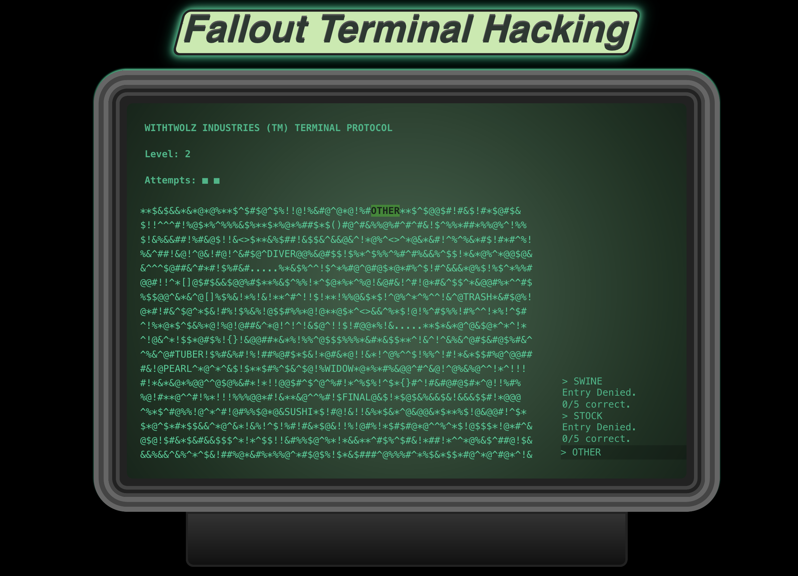

# Hack-A-Term

A Fallout Terminal Hacking mini-game written in Typescript / React

# Instructions

You are a hacker, brute-force hacking into a super computer by guessing the password.  
There are 14 levels, _will you be able to unlock the secrets?_  
[More Info on Fallout Hacking](https://fallout.fandom.com/wiki/Hacking#Overview)

# Setup

This project requires `nodejs` which can be [installed here](https://nodejs.org/en/download).  
Assuming `node`/`npm` is installed you can use the following [Make commands](./Makefile):

---

`make help` - Show available commands  
`make up` - Start the project dev mode  
`make build` - Build the project for production  
`make help` - Preview the project in production mode  
`make install` - Install the relevant [dependencies](./package.json)  
`make clean` - Remove installs/compiled production code and reinstall

# Screenshots

### Legal

_Fallout is a registered trademark of Bethesda Softworks LLC, a ZeniMax Media company.
This project is not affiliated with, endorsed by, or sponsored by Bethesda Softworks,
Obsidian Entertainment, or ZeniMax Media. All Fallout-related trademarks, logos, and game mechanics are the property of their
respective owners. No copyright infringement intended._
